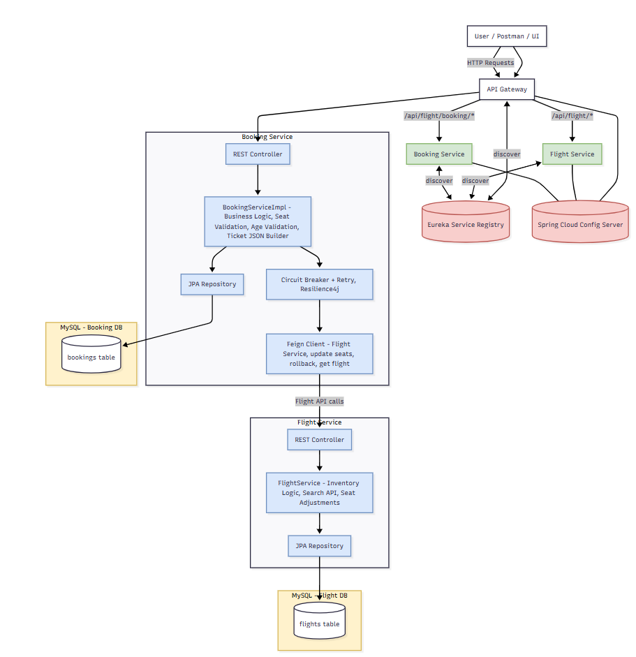

#  FlightApp Microservices

A fully functional **Flight Booking System** built using a **microservices architecture**.  
This project demonstrates clean separation of services, inter-service communication, fault tolerance, centralized configuration, service discovery, and unified API routing.

---

##  System Architecture

---

##  Tech Stack

### **Backend**
- Spring Boot 3  
- Spring Cloud Netflix Eureka  
- Spring Cloud Gateway  
- Spring Cloud Config Server  
- OpenFeign  
- Resilience4j (Circuit Breaker, Retry, Fallback)  
- RabbitMQ (Async Notifications)  
- MySQL (Primary DB)  
- H2 (Test DB)

### **Tools / DevOps**
- Docker  
- SonarCloud  
- JaCoCo (Test Coverage)  
- Postman / Newman  
- Swagger UI  

---

##  Project Goal

Build a scalable microservices-based platform to:

- Search flights  
- Add flight inventory  
- Book flights  
- Cancel bookings  
- View booking history  
- Send notifications  
- Provide a resilient distributed system  

---

##  Microservices Overview

### **1️ Flight Service**
- Add new flights  
- Update seat availability  
- Rollback seats  
- Get flight details  
- Connected to **MySQL**

### **2️ Booking Service**
- Book a ticket  
- Cancel booking  
- Validates age, seats, passengers  
- Uses **Feign** to call Flight Service  
- Publishes events to RabbitMQ  
- Uses **Resilience4j** for retry/fallback

### **3️ Config Server**
- Centralized configuration for all services  
- Loads from GitHub or local repo

### **4️ Eureka Server**
- Service registry  
- Dynamic service discovery  

### **5️ API Gateway**
- Single entrypoint  
- Dynamic routing using Eureka  

### **6️ Notification Service**
- RabbitMQ **consumer**  
- Sends booking confirmation messages  

---
